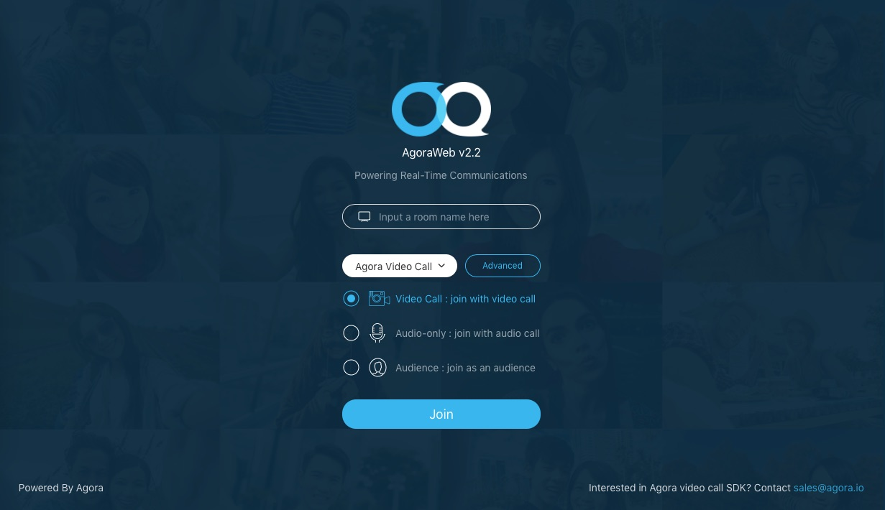

# Agora Open Video Call for Web

This tutorial enables you to quickly get started with creating an Agora account and using the Agora sample app to create an open video call using the [Agora 2.0+ API](https://docs.agora.io/en/2.2/product/Voice/API%20Reference/communication_web_audio#voice-call-api) such as:

## Prerequisites
- Agora.io Developer Account
- Node.js 6.9.1+
- Web server that supports SSL (https)

## Quick Start
This section shows you how to prepare, build, and run the sample application.

### Create an Account and Obtain an App ID
In order to build and run the sample application you must obtain an App ID: 

1. Create a developer account at [agora.io](https://dashboard.agora.io/signin/). Once you finish the signup process, you will be redirected to the Dashboard.
2. Navigate in the Dashboard tree on the left to **Projects** > **Project List**.
3. Copy the App ID that you obtained from the Dashboard into a text file. You will use this when you launch the app.
4. Open the **src/utils/Settings.js** file. At the bottom of the file, replace `<#YOUR APP ID#>` with the App ID in the dashboard.

	**Note:** Remember to place the App ID within single or double quotes.

```xml
export const APP_ID = <#YOUR APP ID#>;
```
	
### Update and Run the Sample Application 

1. In the Terminal app, run the `install` command in your project directory. This command installs the required libraries to run the sample application.

	``` bash
	# install dependencies
	npm install
	```

2. Start the application by running the `run dev` or `run build` command.

	The `run dev` command is for development purposes.

	``` bash
	# serve with hot reload at localhost:8080
	npm run dev
	```

	The `run build` command is for production purposes and minifies code.

	``` bash
	# build for production with minification
	npm run build
	```
	
3. Your default browser should automatically open and load the sample application. Once you have loaded the sample app, your browser will look like this:

	**Note:** If your browser does not automatically open, manually navigate to `http://localhost:8080`.

	

4. Additional commands are available for the sample application.

	Use the `run lint` command to use [**ESLint**](https://eslint.org/) and `run format` command to improve code quality.

	``` bash
	# use eslint and prettier to improve code quality
	npm run lint
	npm run format
	```

	Use the `run test` command to run unit tests.

	``` bash
	# unit testing
	npm run test
	```


## PLACEHOLDER FOR CREATE THE SAMPLE


## Resources
* Complete API documentation is available at the [Document Center](https://docs.agora.io/en/).
* You can file bugs about this sample [here](https://github.com/AgoraIO/Agora-Interactive-Broadcasting-Live-Streaming-Web/issues).

## License
This software is under the MIT License (MIT). [View the license](LICENSE.md).